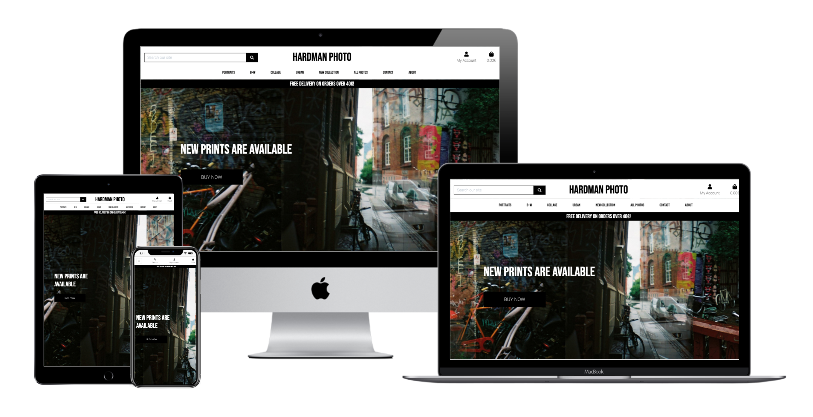

# HARDMAN PHOTO - E-Commerce Web App.

### Code Institute - Final Milestone Project (4) - Full Stack Frameworks With Django.

HARDMAN PHOTO is a Photography webshop with award winning photographs and limited edition prints. The store's collection ranges from portraits to urban landscapes as well as stunning collages. The application allows users to browse the different collections as well as all photos at once.

The live website can be found [here](https://hardman-photo.herokuapp.com/)

## Table of Contents

* [Project Summary](#project-summary)
* [User Experience Design (UX)](#user-experience-design)
  * [The Strategy Plane](#the-strategy-plane)
    * [User Stories](#user-stories) 
  * [The Scope Plane](#the-scope-plane)
  * [The Structure Plane](#the-structure-plane)
  * [The Skeleton Plane](#the-skeleton-plane)
    * [Wireframes](#wireframes)
    * [Database Design](#database-design)
    * [Security](#security)
  * [The Surface Plane](#the-surface-plane)
* [Features](#features)
   * [Existing Features](#existing-features)
   * [Future Features](#future-features)
* [Technologies](#technologies)
* [Testing](#testing)
* [Deployment](#deployment)
    * [AWS S3](#aws-s3)
    * [Heroku Deployment](#heroku)
    * [Local Deployment](#local-deployment)
* [Credits](#credits)

****

# Project Summary

Welcome to my Full Stack Frameworks with Django Project for Code Institute.

The goal of this project was to allow the user to create an account and make a purchase of products with Stripe. Although the majority of the admin activities is done through the Django admin site, the web app also provides more pleasant environment for common tasks such as adding, editing and deleting products or blog posts through the web app's UI.
I have developed this ecommerce shopping website with Django which is powerful and flexible. The Django and Stripe frameworks have been used to take care of sensitive customer information in a secure manner.

## The Strategy Plane

HARDMAN PHOTO is a web-shop for photographer and visual artist, Claire Hardman, based in Stockholm, Sweden. The customer can successfully purchase items and have them delivered to their home. Different sizes are available based on commonly used print measurements.

## User Stories

As an e-commerce site owner...

* As a store owner, I want to be able to add a product so that I can add new items to my store.
* As a store owner, I want to be able to edit/ update a product so that I can change product prices, descriptions, images and other photo criteria.
* As a store owner, I want to delete a photo so that I can remove photos that have run out of limited print.

As a customer...

* I want a líst of photos so that I can select a photo to purchase.
* I want to view a specific category of products so that I can quickly find photos that I'm interested in without having to search through all photos.
* I want to view photo details so that I can view the sizes available and choose the quantity I would like to purchase.
* I want to easily view the the total amount of my shopping bag to know how much I am spending.
* I want to successfully register for an account and proceed to log in.
* I want to easily access my previous orders.
* I want to be able to store my shipping details so that it’s easier for me to check out.
* I want to be able to contact the store of the website incase I have any issues or questons.
* I want to be able to easily recover my password in case I have forgetten it.

## The Scope Plane 

When designing the page, I wanted the user to have a positive experience aka intuitive, easy and visually appealing. The user can navigate the website using the navigation bar that is always visible. The user can navigate to different sections easily and intuitively.

### Features planned:

* Responsive Design - The site should function on mobile, tablet and desktop/laptop devices.
* Mobile and desktop navigations.
* Standard e-commerce feed of products with the option to sort products and filter them by category name. 
* Every product can be added to the bag immediately and links to a product page where the user can read more about it.
* About page with information about the photographer who has created the photos.
* Contact information and a contact form to easily contact the store.

## The Structure Plane

When the user opens the site, they see the hero image and  Call-to-action text and a buy now button which leads them to all photographs available for purchase. On smaller devices there is a link in the hamburger menu. There is also a link for each section of the website in the navigation bar.

The categories of photos available are shown in the always visible navigation menu at the top of the page. If a user wishes to see more about the photo they may click on the photo which takes them to the product details where they can see sizes available and an option to add it to the bag. If the user adds to the bag, they will see a message at the top of the page informing them that they have put that product with quantity they have chosen in their bag.

The about page contains a blurb about the photographer to the right and an image of the photographer to the left.

In a bag section, users can see all the items in their bag and if they wish to change its quantity, easily select the plus or minus sign followed by the update button. They can also choose to remove that item altogether with the remove button. Confirmation messages are shown in the top right corner with corresponding and intuitive colors. Once the user is ready for checkout, they can click through to the checkout section where they see a form see a form to fill in in order for the checkout to be completed. Once completed, the order will be stored in the order history of the users profile and user may access it at anytime.

## The Skeleton Plane

### Wireframes

Wireframes for this project may be viewed in a seperate file [here](wireframes.md).

### Database Design

As Django works with SQL databases by default, I was using SQLite in development. Heroku, however, provides a PostgreSQL database for deployment

### User Model

The User model utilized for this project is the standard one provided by `django.contrib.auth.models`

### Profiles App

| Name | Database Key | Field Type | Type Validation |
| :-------------: |:----------------:| :--------------: | :---------: |
|User | user |	OneToOneField 'User'| on_delete=models.CASCADE
|Default Phone Number |	default_phone_number | CharField | max_length=20, null=True, blank=True
|Default Country | default_country | CountryField | blank_label='country', null=True, blank=True
|Default Postcode | default_postcode | CharField | max_length=20, null=True, blank=True
|Default Town or City | default_town_or_city | CharField | max_length=40, null=True, blank=True
|Default Street Address1 | default_street_address1 | CharField | max_length=80, null=True, blank=True
|Default Street Address2 | default_street_address2 | CharField | max_length=80, null=True, blank=True

### Products App

`Category` model

| Name | Database Key | Field Type | Type Validation |
| :-------------: |:----------------:| :--------------: | :---------: |
|Name | name | CharField | max_length=254
|Friendly Name | friendly_name | CharField | max_length=254, null=True, blank=True

`Product` model

| Name | Database Key | Validation | Field Type|
| :-------------: |:----------------:| :--------------: | :---------: |
|Product id | id | primary_key=True | AutoField
|Name | name | default='', max_length=254 | CharField
|Price | price | max_digits=6, decimal_places=2 | DecimalField
|Image| image| blank=False | ImageField

### Order

| Name | Database Key | Validation | Field Type|
| :-------------: |:----------------:| :--------------: | :---------: |
|Order id | id | primary_key=True | AutoField
|User | user | User, on_delete=models.CASCADE, related_name="orders" | ForeignKey(User)
|Full name | full_name | max_length=50 | CharField
|Phone number | phone_number | max_length=20, blank=False | CharField
|Country | country | max_length=40, blank=False | CharField
|Postcode | postcode| max_length=40, blank=True | CharField
|Town or City | town_or_city | max_length=40, blank=False | CharField
|Street address 1 | street_address1 | max_length=40, blank=False | CharField
|Street address 2 | street_address2 | max_length=40, blank=False | CharField
|County | county | max_length=40, blank=False | CharField
|Date | date | default=timezone.now | DateField
|Total price | total_price | max_digits=100, decimal_places=2, default=0.00 | DecimalField

### OrderLineItem

| Name | Database Key | Validation | Field Type|
| :-------------: |:----------------:| :--------------: | :---------: |
|Order Line Item id | id | primary_key=True | AutoField
|Order | order | Order, related_name="orderline", null=False | ForeignKey
|Product | product | Product, null=False | ForeignKey
|Quantity | quantity | blank=False | IntegerField

### Security

Using config variables in heroku, all SECRET access keys are stored safely to prevent unwanted connections to the database.

Django allauth was used to set up user registration and built in decorators allowed restricted access to certain features on the website that are not intended for regular users.

## The Surface Plane

### Colour Scheme

As is the case with photography stores, both online and physically, photography galleries and museums black and white is the driving color scheme. The stark contrast of light and dark are the very basis of photography and this color simplicity allows the photography on display to shine.

### Typography

The main font used throughout the website is 'Bebas Neue' and 'Roboto'. These are strong and simple fonts that compliment the purpose and feel of the website.

### Images

The images used in the website have been created by the websites photographer Claire Hardman.

# Features

## Existing Features

Web App Sections:
* Navigation bar
    * Navigation bar is visible on all pages and on all sizes (on a smaller width, it toggles into "hamburger"). It contains the website's logo and links to each section of the website.

* Footer section
    * Footer section contains links to the social media profiles, copyright information and contact information if the user does not wish to use the contact form provided on the contact page.

* Webshop
    * Every item is clickable which navigates to a product details page where the user can read more about it, including sizes, name, category, price and an add button if they would like to add the item to their bag.

* About page
    * Provides information about the photographer who is featured on the website.

* User account 
    * Available to registered/logged in users with the purpose of tracking their order history and safely storing shipping details for a secure and easy checkout.

* Admin account
    * Users with admin rights have access to orders, user profiles, as well as product and blog inventory. The majority of the information is stored in the Django admin site but the admin users may also do common tasks such as adding, editing and deleting products via the site.

## Future Features

### Blog

* I would like to implement a blog as I've read that websites with blogs and frequently updated information rank higher in searches.

### Heart/favorites function

* A feature that allows authenticated users to heart/favorite items so that they can see items those items in favorites section. 
* Every product in the feed and on product pages would have a heart-shaped icon which would add the product to this favorites section. The list could be accessed on one of the profiles pages, where users can remove the items from the list as well.
* This feature is to increase the conversion rate and familiarity with the user.

## Features and Django Apps

HARDMAN PHOTO, [A Django project](https://docs.djangoproject.com/en/3.1/ref/applications/), consists of 7 Django applications listed below. As explained in Django's documentation - a Django application describes a Python package that provides some set of features. Applications may be reused in various projects.

* `about`
* `bag`
* `checkout`
* `contact`
* `home`
* `products`
* `profiles`

The following list of features is structured in a way that should help with understanding of how the features are spread throughout the project.

### Search functionality

* A Search box is part of the top navigation and is, therefore, accessible on all pages.
* On mobile and ipad the search bar is collapsed under the search symbol.
* It allows customers to enter keywords associated with the products they wish to purchase.
* The search results are displayed as a feed of products by using the page templates prepared for the `products` Django app.

### Toasts

* Small snippets of messages divided into 4 main categories: `toast_success`, `toast_info`, `toast_warning` and `toast_error`.
* They appear on every page whenever a certain action has been done by the user.
* Their purpose is to give feedback on the action a user has just performed, such as logging in, logging out, adding a product to the bag, updating the bag, changing their user info, finishing the checkout process, etc.

### Django-allauth feature

* `django-allauth` is a Python package. As written in the [django-allauth docs](https://django-allauth.readthedocs.io/en/latest/), it is an "integrated set of Django applications addressing authentication, registration, account management as well as 3rd party (social) account authentication."
* It provides a set of features such as **signup**, **login**, **logout** and **password change**
* After signing up, a verification e-mail is sent to the registered e-mail to confirm it. Once confirmed, the user can log in with their credentials and access the `profiles` app.
* The links to these features can be found in the navigation, under the **My Account** dropdown menu, as well as on the pages and throughout the web app.

### Automatic e-mails

* An account is working for this project and used as a sender for all verification, reset and confirmation e-mails.
* For example, users receive an order confirmation e-mail after a purchase, account verification e-mail after the registration, password reset e-mail after requesting a password reset, etc.

### Home app

* `home` Django app mainly serving as an introduction to the company and the marketplace.

### About app

* `about` Django app contains an image and a blurb about the photographer featured on the store.

### Products app

* `products` Django app is where all the logic and templates connected to individual products are.
* It can be divided into three main sections: **shop**, **product pages** and **admin product management activities**.
* **Shop** is the landing page where shoppers start. Here they have access to the nav bar with all categories, a search bar and a buy now button which takes them to all photos where they can browse through all photography avaible on the website. This also features a sort function via the sort dropdown where they can sort by price, name and category.
* By clicking on a product, the user can see the full product info including pictures of product, name, price and an add button if they would like to add product.
* **Admin product management** activities include adding, editing and deleting products. Users with admin rights can do that directly in the UI through forms.

### Bag app

* `bag` Django app is a standard e-commerce functionality which aids the checkout process.
* A bag icon is always present in the top right corner of the web app. The bag adds a number under the bag icon allowing users to know the current amount of their bag.
* Users can edit the quantity of items or remove them from bag and view the total amount of the bag. In order to proceed with checkout, the user will be required to register on the site or be logged in. When the user decides to finish shopping, they will need to input their information and credit card details to complete the purchase.
* If users try to access their empty bags, there will be a message displayed that nothing has been added yet and encourage them to go to the shop.

### Checkout app

* `checkout` Django app is another standard e-commerce functionality which enables users to buy the products online from the webshop.
* In order to check out, the user is presented with a form asking for the shipping and payment details and with the overview of the order.
* Users can easily go back to the bag and adjust it by clicking on the bag icon in the top right corner.
* A webhook is implemented to the checkout so that the order is successfully processed in case the checkout process gets interrupted. Some reasons might be closing the browser too soon or losing internet connection.
* "payments" are handled through `stripe`. A test purchase can be made with the following details:
    * credit card: 4242 4242 4242 4242
    * expiration date: 04 / 24
    * CVC: 424
    * ZIP: 42424
* After the payment has been processed, the user is presented with the order summary on the order confirmation page.
* Users can also see their **order history** on the `profiles pages`.

### Profiles app

* `profiles` Django app is available to registered, authenticated users.
* It offers 2 features: order history and saving shipping information.
* **Order history** displays all previous orders per user account.
* Saving shipping information is done through a form which can be edited anytime. This information is what populates the checkout form for the next orders and where shipping information saved during the checkout process is stored.

### Contact app

* `contact` Django app is available to all users. This is to make it easier for users to contact the store owner about potential purchases or project proposals.

# Technologies

The website is designed using following technologies:

## Programming languages

* HTML - the project used HTML to define structure and layout of the web page;
* CSS - the project used CSS stylesheets to specify style of the web document elements;
* JavaScript - the project used JavaScript to implement Stripe, EmailJS and custom Javascript.
* Python - the project back-end functions are written using Python.

## Libraries

* [Font Awesome](https://fontawesome.com/v4.7.0/) - Font Awesome icons were used throughout the web-site.
* [jQuery](https://jquery.com/) - is a JavaScript library designed to simplify HTML DOM tree traversal and manipulation.

## Frameworks & Extensions

* [Django](https://www.djangoproject.com/) – Django is a high-level Python Web framework that encourages rapid development and clean, pragmatic design.
* [Bootstrap](https://getbootstrap.com/) – Bootstrap is a web framework that focuses on simplifying the development of informative web pages.
* [EmailJS](https://www.emailjs.com/) – Service that helps sending emails using client side technologies only. It only requires to connect EmailJS to one of the supported email services, create an email template, and use their Javascript library to trigger an email.
* [Stripe](https://stripe.com/ie) – Allows individuals and businesses to make and receive payments over the Internet.

## Database
* [Heroku Postgres](https://www.heroku.com/postgres/) – PostgreSQL is one of the world's most popular relational database management systems.

## Others

* [GitHub](https://github.com/) - GitHub is a global company that provides hosting for software development version control using Git.
* [Gitpod](https://gitpod.io/workspaces/) - One-click ready-to-code development environments for GitHub.
* [Heroku](https://dashboard.heroku.com/) - Heroku is a cloud platform that lets companies build, deliver, monitor and scale apps.
* [AWS-S3](https://aws.amazon.com/s3/) – Object storage service that offers industry-leading scalability, data availability, security, and performance.

# Testing

**Testing section is located [here](testing.md)**

### Validating code

* HTML
code is validated through [W3 validator](https://validator.w3.org/).

* CSS
code is validated through [W3 Jigsaw](https://jigsaw.w3.org/css-validator/).

* JavaScript
code is validated through [JS Hint](https://jshint.com/).

* Python
code is validated through [PEP8](http://pep8online.com/).

# Deployment

## AWS S3
Created a new Amazon account and connect to amazon service AWS3 account are cloud based serve where the project media and staicfiles will be stored unto. At first, we locate S3 on amazon service then we create a bucket. While creating the bucket on S3, the note that public access must be all switched off to allow access for users.

Once we've created the bucket, we now can now click on it's properties and enable the Static Website Hosting option, so it can serve the purpose of hosting our static files, you will need to imput an index.html and error.html before saving. Then we go into the created bucket Permissions and click into CORS configuration, this part already have a prefilled default config, All that is needed is just to write the default code and save the config.

Then we go into the bucket policy to allows access to the contents across all web and inside this we will put in here some code including arn address displayed at the top of the heading. Then we go into amazon IAM to allow identity and access management of our stored files and folder. In the IAM service, we add a new group for our application and then we set the policies to ALL Then it generates a downlaodable zip file containing ID and KEY for us to use for the newly added group. This ID and KEY as to be stored in an environment variable.

This then allows us to into our terminal window and install some settings Boto3 Django Storages

The Django Storages is passed into the installed apps in settings and also a custom_storage file is created to store credentials in environment variable. And once everything looks fine we can run python3 manage.py collectstatic. This will collect all the static files in our app including any changes that is made. N.B this command has to be run in the development(local) environment each time a change is been made in the static files/folder And your folder and files should display in your AWS S3 BUCKETS

## Heroku Deployment 

#### Create application:

1. Navigate to Heroku.com and login.
2. Click on the new button.
3. Select create new app.
4. Enter the app name.
5. Select region.

#### Set up connection to Github Repository:

1. Click the deploy tab and select GitHub - Connect to GitHub.
2. A prompt to find a github repository to connect to will then be displayed.
3. Enter the repository name for the project and click search.
4. Once the repo has been found, click the connect button.

#### Add PostgreSQL Database:

1. Click the resources tab.
2. Under Add-ons seach for Heroku Postgres and then click on it when it appears.
3. Select Plan name Hobby Dev - Free and then click Submit Order Form.

#### Set environment variables:

1. Click on the settings tab and then click reveal config vars.
2. Variables added: 
    * AWS_ACCESS_KEY_ID 
    * AWS_SECRET_ACCESS_KEY 
    * DATABASE_URL 
    * EMAIL_HOST_PASS 
    * EMAIL_HOST_USER
    * SECRET_KEY 
    * STRIPE_PRICE_ID 
    * STRIPE_PUBLIC_KEY 
    * STRIPE_SECRET_KEY 
    * STRIPE_WH_SECRET 
    * USE_AWS 

#### Enable automatic deployment:

1. Click the Deploy tab
1. In the Automatic deploys section, choose the branch you want to deploy from then click Enable Automation Deploys.

## Local Deployment

1. Navigate to the GitHub Repository.
2. Click the Code drop down menu.
3. Either Download the ZIP file, unpackage locally and open with IDE (This route ends here) OR Copy Git URL from the HTTPS dialogue box.
4. Open your developement editor of choice and open a terminal window in a directory of your choice.
5. Use the git clone command in terminal followed by the copied git URL.
6. A clone of the project will be created locally on your machine.

Once the project has been loaded into an IDE of choice, run the following command in the shell to install all the required packages: pip install -r requirements.txt

# Credits

## Content

* All photos used in this website have been created by the websites photographer Claire Hardman. Websites used for inspiration are:
    * [Poster Store](https://posterstore.se/)
    * [Dear Sam](https://dearsam.se/)

## Coding Sources

* Videos from Code Institute

## Acknowledgments

* Huge thanks to the gang at Code Institute Tutor Support and student Care for all their guidance, patience and support.