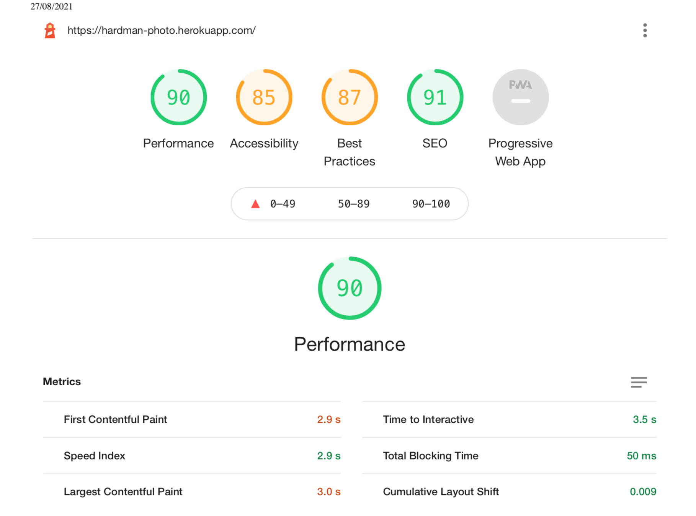

<h1 align="center">Testing</h1>

---

## Index 
- <a href="#manual-testing">1. Manual testing</a>
    - <a href="#visitor-goals">1.1 Visitor goals</a>
    - <a href="#consumer-goals">1.2 Consumer goals</a>
    - <a href="#returning-goals">1.3 Returning customers goals</a>
    - <a href="#admin-goals">1.4 Admin goals</a>
- <a href="#automated-testing">2. Automated testing</a>
- <a href="#validators">3. Code validators</a>
- <a href="#responsiveness">4. Responsiveness</a>
- <a href="#browser-compatibility">5. Browser compability</a>
- <a href="#other">6. Other</a>
- <a href="#bugs">7. Bugs</a>
- <a href="#future-testing">8. Future testing</a>

---

## 1. Manual testing

**All User Stories are tested with manual testing.**

### 1.1 Visitor goals

1. As a visitor, I want to access the website from any device, so that I can use the website on desktop, mobile and tablet.

    **Testing**
    - The visitor can use the website on any device. The website is designed for computer, mobile and tablet. The test for the responsiveness with different devices can be found <a href="#responsiveness">here</a>
    - **Result:** Test passed
2. As a visitor, I want to be able to navigate easily through the website, so I can find everything easily. 

    **Testing**
    - A visitor can navigate through the website with the navbar at the top of the website. There is a hamburger menu for mobile visitors, where they can easily can go to the desired page.
    - The main navigation is through the navbar and contains the following: 
        - Search functionality, where visitors can search for products. The search functionality is based on the title or descriptin of a product. 
        - The profile icon is where all profile related pages are. These are: the profile page, the login, logout and sign up pages. A visitor who is logged in can go to their profile and can logout through the profile icon. Visitors who aren't logged in can login or signup through the profile icon.
        - The shopping bag icon is a link to the shopping bag. Below the icon and whatever page you are on in the site, you can see the amount in euros that are in your shopping bag. 
        - Links to the different categories of photos.
        - A link to the about page for the company. 
        - A link to the contact form for the site. 
    - The footer contains the following: 
        - Links to the sites social media. 
        - An email address if the user wishes to contact the company via other means than the contact form. 
        - Copyright information 
    - **Result:** Test passed. All links are working and the links are connected to the right page. The search functionality and the profile functionality with showing the right links whether a visitor is logged in or logged out are working correctly.

3. As a visitor, I want to access the social media accounts of the company, so I can follow them and see the latest trends and news.

    **Testing**
    - Social media icons are in the footer where visitors can click on. The social media icons are Pinterest, Facebook and Instagram. 
    - **Result:** Test passed: all social media icons are visible for any device and the links lead to the social media websites.

4. As a visitor, I want to know more about the company, so I know what the company is about.

    **Testing**
    - There is an about page with information about the company and the photographer.
    - **Result:** Test passed. The page contains company information and information about the photographer.

5. As a visitor, I want to be able to contact the owners of the website, so I can easily ask a question or make a comment. 

    **Testing**
    - A link to the contact page can be found in the navbar of the website. 
    - There is a contact page where visitors can send their questions and comments. 
    - In the footer, available on all pages, users can find the email address to contact the company. 
    - **Result:** Test passed. Visitors can fill in the form with any questions or can contact the company through email.

6. As a visitor, I want to see an overview of all the photos, so I can see what the website is offering.

    **Testing** 
    - The 'all photos' page gives an overview of all photos available to purchase on the site.
    - The page shows a back to top button in case the website has a lot of products and the visitor has scrolled down a lot.
    - **Result** Test passed. All photos are on the products page, the back to top button works and the category links are showing the right results.

7. As a visitor, I want to be able to search and filter through the photos, so I can find specific photos quickly and easyily.
    
    **Testing**
    - Visitors can sort the products based on price from low to high or from high to low. 
    - Visitors can sort the products based on alphabet or category from A - Z or Z - A.
    - **Results:** Test passed. The sort functionality is working on the all photos page and in the category sections.

8. As a visitor, I want to be able to read more information about the photos (name, price, sizes available, category, image), so the user can see more detailed info about the photograph. 

    **Testing**
    - Visitors can visit the product detail page by clicking on the image of the product. 
    - The product detail page shows the following information: name, category, price, sizes available. 
    - Visitors can buy the photo and set the quantity they wish to purchase.
    - **Result:** Test passed: All product information is on the detail page.

### 1.2 Consumer goals 

9. As a consumer, I want to add photos to my basket, so I can purchase them. 

    **Testing**
    - The consumer can choose the quantity of the product and can add the product to the basket by clicking on the add to bag button. 
    - The quantity can be set from 1 - 99. 
    - The quantity can be modified by typing in the number or by using the -/+ functionality. 
    - The add to bag button will put the product on the shopping bag. 
    - A succes toast message shows when the product is added to the shopping bag.
    - The amount in the navbar changes to the total price of the shopping bag.
    - **Result:** Test passed. All functionalities of the toast message, add to bag and quantity are working as expected. 

10. As a consumer, I want to modify my order, so I can make adjustments before I place my order.
    
    **Testing**
    - The consumer can modify the quantity of the order on the shoppingbag. The consumer can do this by changing the quantity and by clicking update.
    - **Result:** Test passed. The quantity updates when the consumer sets another quantity and clicks on update.

11. As a consumer, I want to be able to delete products in my order, so I can remove products that I no longer wish to purchase. 

    **Testing**
    - The consumer can delete the product in the shopping bag by clicking on remove. 
    - **Result:** Test passed. The product is deleted when a consumer clicks on remove.

12. As a consumer, I want to see the total price and shipping costs of my order, so I can see how much I have spent in total. 

    **Testing**
    - The consumer sees the price, shipping costs and the total price of the order. 
    - Free delivery is provided at 40€ or highter. The delivery costs are otherwise 10% of the order. 
    - The total price is automatically deducted from the product price and any shipping costs.
    - **Results:** The product price, shipping costs and total price are automatically calculated and are correct.

13. As a consumer, I want to pay with a card in a safe and secure way, so I know that my payment goes through and my information is stored safely. 

    **Testing**
    - Consumers can pay with credit card and the payment goes via Stripe payments. 
    - The stripe setup is based on a test environment. A consumer can fill in the number 4242 4242 4242 4242  to make a succesful payment. 
    - A Stripe webhook is implemented for extra secure payments. 
    - The consumer has to fill in personal information and delivery information. 
        - The required fields are full name, email address, phone number, country, town or city and street address 1. 
        - The email has a validator where someone has to use a @. 
        - The country field is a dropdown with all countries. 
    - **Result:** Test pass. The Stripe payments are working fine. And the checkout form is valid. 

14. As a consumer, I want to create an account, so I can see my profile details and order history. 

    **Testing**
    - A consumer can create an account by signing up. 
    - The consumer can see their personal information, delivery information and the order history. 
    - The consumer can change the delivery information by updating the details and the consumer can change the password or manage email.
    - **Results:** Test passed. 

### 1.3 Returning consumer goals 

15. As a returning consumer, I want to login and logout of my account anytime, so I can make an order quickly and so I can see my order history. 

    **Testing**
    - The returning consumer can login and logout through the links dropdown menu of the profile icon in the navbar. 
    - The consumer has a double check for logging out.
    - **Result:** Test passed. The consumer can login and logout easily. 

16. As a returning consumer, I want to reset/change my password (if I forgot it), so I can get access to my profile. 

    **Testing**
    - The password can be changed by clicking the button on the profile page or by the login page. 
    - **Result:** Test passed. The password change functionality is working.

### 1.4 Admin goals

17. As admin, I want to add, modify and delete products, so I can manage the assortment of all products on the website. 

    **Testing**
    - The admin can add a product by clicking on the profile icon and add product. The admin gets a form to fill in and can add a product to the website. 
    - The admin can edit a product by clicking on the product detail page of the product and click on the edit link. The admin gets a filled in form with the details of the product. The details of the product can be updated and be saved. 
    - The admin can remove products by clicking on the product detail page of the product and click on the delete link. A notification will show if the admin is sure to delete the item. The product is deleted by clicking on delete again. 
    - **Results:** Test passed. The add, edit and delete functionallity is working as expected.

## 1. Automated testing

### Testing apps
Automated testing is used to support the manual testing. The manual testing helped by testing the back-end code with views and due to time constraints only them.

### Lighthouse testing

I used the automated tool Lighthouse from Chrome to test the quality of the web pages. 

**The result:** 

## 2. Validators

 - **[HTML Validator](https://validator.w3.org/):** No major errors to show.
    - I tested the HTML code by running it throgh the validator mentioned above.

    **The following errors/warnings are showing**
    - There were errors saying that only an 'li' element may be the direct child of a 'ul' element. This is true of all pages I checked.
    - Error Duplicate ID: This error comes from the mobile navbar and desktop navbar.
    - Warning: the type attribute is unnecessary for JavaScript resource.

    **Result:** The rest of the code passed and there where no errors.

- **[CSS Validator](https://jigsaw.w3.org/css-validator/):** No major errors found.

    **Results:**
    - Unkown vendor extensions
    - checkout.css: no errors found
    - profiles.css: no errors found

- **[JS Hint](https://jshint.com/):** No errors found.
    
    **Results:**
    - Warnings 
        - 'template literal syntax' is only available in ES6 (use 'esversion: 6')
    - Undefined variables: $

- **[Python validator | PEP8](http://pep8online.com/):** No errors found

    **Results:** No errors found!

---

## 3. Responsiveness 
- Responsiveness of the site is tested with [Chrome DevTools](https://developers.google.com/web/tools/chrome-devtools) and [Responsive Design Checker](https://www.responsivedesignchecker.com/).
- This site was was tested on multiple browsers (Google Chrome, Mozzila Firefox and Opera), multiple mobile devices (Samsung Galaxy, Huawei, Sony) and tablet devices(Samsung Galaxy Tab) and showed responsivness and compatibility.

| Functionality | Expected Outcome | Actual Outcome | Pass/Fail |
| :-------------: |:----------------:| :--------------: | :---------: |
| Viewing on mobile device | Images adapted, no overflow | As Expected | Pass |
| Viewing on tablet device | Pages rendering properly, no distortion | As expected | Pass |
| Viewing on laptop device |  No distortion | As expected | Pass |
| Viewing on desktop device up to 2k | No distortion | As expected | Pass |

## Overall

### Navigation

| Functionality | Expected Outcome | Actual Outcome | Pass/Fail |
| :-------------: |:----------------:| :--------------: | :---------: |
| Clicking on Logo button | Opens "Index" page | As Expected | Pass |
| Clicking on `Buy now` link | Opens page with all photos | As expected | Pass |
| Clicking on `log In` link | Opens Log In page | As expected | Pass |
| Clicking on `Register` link | Opens Register page | As expected | Pass |
| Clicking on `my account` link | Opens dropdown tab with links | As expected | Pass |
| Clicking on `log Out` link | Logs out user and redirects to log in page | As expected | Pass |

### Button "Go to top" (only on mob and tablet)

| Functionality | Expected Outcome | Actual Outcome | Pass/Fail |
| :-------------: |:----------------:| :--------------: | :---------: |
| Clicking on Go to top button | Scrolls up to top of the page | As Expected | Pass

### Footer

| Functionality | Expected Outcome | Actual Outcome | Pass/Fail |
| :-------------: |:----------------:| :--------------: | :---------: |
| Clicking on `Facebook` icon | Opens Facebook website in new tab | As expected | Pass |
| Clicking on `Instagram` icon | Opens Instagram website in new tab | As expected | Pass |
| Clicking on `Pinterest` icon | Opens Pinterest website in new tab | As expected | Pass |

## Home

| Functionality | Expected Outcome | Actual Outcome | Pass/Fail |
| :-------------: |:----------------:| :--------------: | :---------: |
| Clicking on product cards | Opens the selected product detail | As expected | Pass |
| Clicking on `buy now` button | Opens the products page | As expected | Pass |

## Shop

| Functionality | Expected Outcome | Actual Outcome | Pass/Fail |
| :-------------: |:----------------:| :--------------: | :---------: |
| Clicking on filter button | Show products under that category | As Expected | Pass
| Clicking on product | Show product details info on a new page | As Expected | Pass
| Selecting the number in input and clicking "Add" | Adds the selected quantity of the item to bag and then opens "all products" page |As Expected | Pass |

## Bag & Checkout

| Functionality | Expected Outcome | Actual Outcome | Pass/Fail |
| :-------------: |:----------------:| :--------------: | :---------: |
| Changing quantity and clicking on +/- buttons | Changes quantity of item. If quantity changed to zero, removes product from bag | As Expected | Pass
| Clicking on products image and/or name |S hows that products detail page | As Expected | Pass
| Clicking on `Checkout` button | Opens "Chekout" page | As Expected | Pass
| Clicking on `Submit` button without filling the form | Redirects user to required field | As Expected | Pass
| Clicking on `Submit` button after filling out the form | Checks with Stripe if everything is ok and redirects to "Bag" page | As Expected | Pass
| Clicking on `Submit` button after filling out the form with un-authenticated user | redirects to "login" page | As Expected | Pass

## Account

### Registration

| Functionality | Expected Outcome | Actual Outcome | Pass/Fail |
| :-------------: |:----------------:| :--------------: | :---------: |
| Clicking on Register button | Registers the user and redirects to confirm email address. If registration form is incomplete, shows Please fill out this field | As Expected | Pass

### Sign in

| Functionality | Expected Outcome | Actual Outcome | Pass/Fail |
| :-------------: |:----------------:| :--------------: | :---------: |
| Clicking on `Log In` with correct username and password | Directs user to the index page | As Expected | Pass |
| Clicking on `Log In` with Incorrect username and password | flash message to user showing incorrect username or password | As Expected | Pass |
| Clicking on Forgot password | Opens "Forgot password" page | As Expected | Pass

### Profile

| Functionality | Expected Outcome | Actual Outcome | Pass/Fail |
| :-------------: |:----------------:| :--------------: | :---------: |
| Clicking on Edit profile button | Opens "Edit profile" page |As Expected | Pass
| Clicking on `Update` button | Saves changes to profile and redirects to "Profile" page | As Expected | Pass

### Orders

| Functionality | Expected Outcome | Actual Outcome | Pass/Fail |
| :-------------: |:----------------:| :--------------: | :---------: |
| If no items, clicking on `Buy now` button | Shows "all products" page | As Expected | Pass
| Clicking on a `order history` | Shows user's previous orders with all information | As Expected | Pass

### Log Out

| Functionality | Expected Outcome | Actual Outcome | Pass/Fail |
| :-------------: |:----------------:| :--------------: | :---------: |
| Clicking on `log Out` button | Logs out user and redirects to index page | As expected | Pass |

---

## 4. Bugs Fixed

1. Upon first submission the correct database was not connected - This was fixed by adding an env.py file. I've spoken to a couple of tutors how this could've happened but it's still unclear as to why I tested the website all day whilst writing the testing readme and then 5 min before submission it reverted to a db that I had deleted. The workspace was always pinned but the env.py file was not there. Upon adding that it worked as expected. 

2. Custom error pages weren't working because of typos. I fixed these and added formatting and extra styling. I was able to trigger the 404 page by typing an unknown address appnded to the regular heroku url.

3. When filling in details for payment there was a spinning icon in the bottom left corner and the form did not go through. Checkout.css was not connected. The checkout.css url was missing. Upon adding the block css it worked as expected.

## 4. Bugs Unresolved

1. The product input field in the shopping bag app should only be allowed to go to 0. However due to time constraints I was unable to find a way to fix this. 

2. The email order confirmation is not being sent. Due to time constraints I was unable to fix this.

3. In the profile page and order history page the item name has the word 'size' after the 'name'. For some reason it is not showing the exact size that was selected. Due to time constraints I was unable to fix this.

4. My mentor Precious pointed out that upon entering a decimal number in the input field the app crashes. Due to time constraints I was unable to fix this.

---

## 5. Future testing 

Testing is obviously a massive part of developing a web application. Some argue that as much time should be spent testing the application as should be devloping the application. In the future, with more time and knowlegde I would like to improve the testing and resolve the bugs that are still present.

---

[Go to README.md file](README.md).